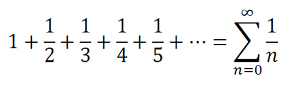

# Dizideki Elemanların Ortalamasını Hesaplayan Program

```
public class Main {
public static void main(String[] args) {
int[] numbers = {1, 2, 3, 4, 5};
int sum = 0;
for (int i = 0; i < numbers.length; i++) {
sum += numbers[i];
}

        System.out.println(sum / numbers.length);
    }
}
```
---

## Ödev

   
>Dizideki sayıların harmonik ortalamasını hesaplayan programı yazınız.
Harmonik Ortalama formülü : n (eleman sayısı) / elemanların harmonik serisi

<hr>

***Harmonik Seri Formülü :***



### Linkler
> <a href="https://app.patika.dev/emrevaljean" target="_blank">Patika Profilim için</a>

<hr>